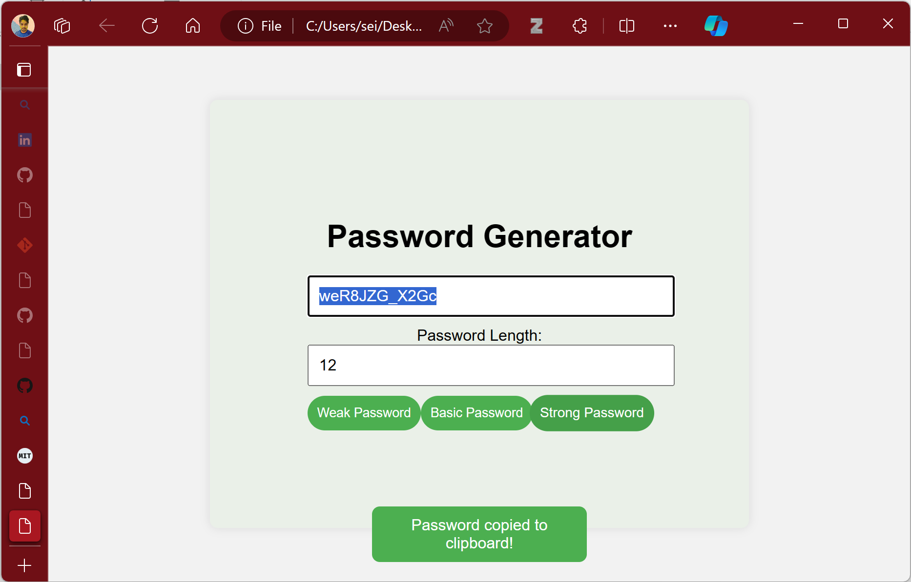

# Random Password Generator Project

This project is inspired by [Amish Aphabba's Random Password Generator](https://github.com/amishaphabba/RandomPasswordGenerator). I, Aman Darolia, in collaboration with ChatGPT, have created a simple and effective random password generator with additional enhancements.

## Project Overview

The Random Password Generator is a web-based application that allows users to generate secure passwords of varying strengths. Notable features include:

- Input field to specify password length.
- Three buttons to generate weak, basic, and strong passwords.
- Responsive design for optimal user experience on different devices.
- Hover effects, autofocus, and other UX improvements.
- A notification system for informing users when the password is copied to the clipboard.

## How to Use

1. Open the [Random Password Generator](#) in your web browser.
2. Input the desired password length in the dedicated text box.
3. Choose the strength of the password by clicking on the corresponding button:
   - **Weak Password**: Generates passwords using lowercase alphabets.
   - **Basic Password**: Generates passwords using both lowercase and uppercase alphabets.
   - **Strong Password**: Generates complex passwords with mixed-case alphabets, numbers, and special characters.
4. The generated password will be displayed in the input field.
5. The password is automatically copied to the clipboard, and a notification will confirm the action.
6. Copy and use the password as needed.

## Screenshots

## Credits

This project was made possible with the help of [ChatGPT](https://openai.com/), a powerful language model created by OpenAI. Special thanks to [Amish Aphabba](https://github.com/amishaphabba) for the initial inspiration.

## Contributions

Aman Darolia (that's me!) made additional enhancements using developer tools, including a notification system for a better user experience.

## License

This Random Password Generator project is licensed under the [MIT License](https://mit-license.org/).

